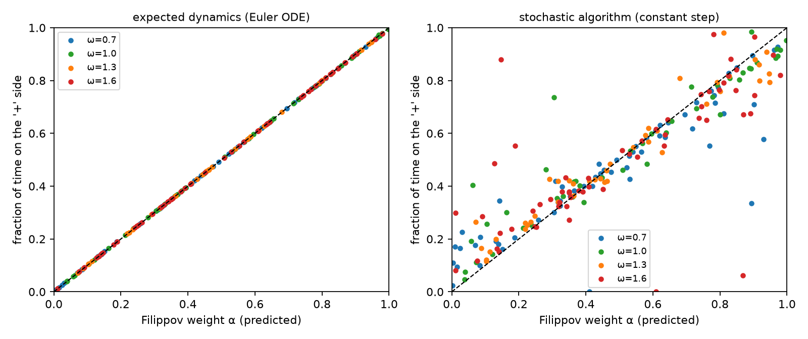
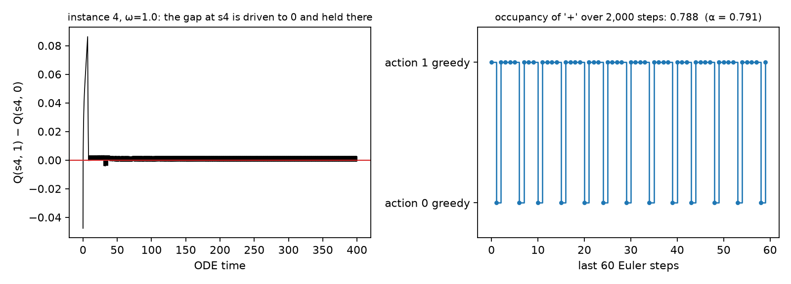
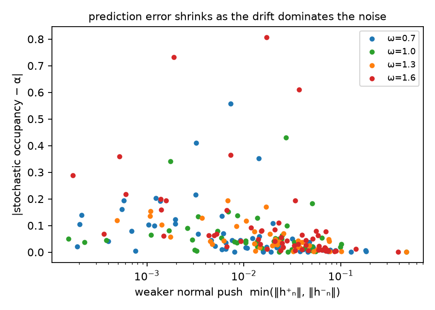
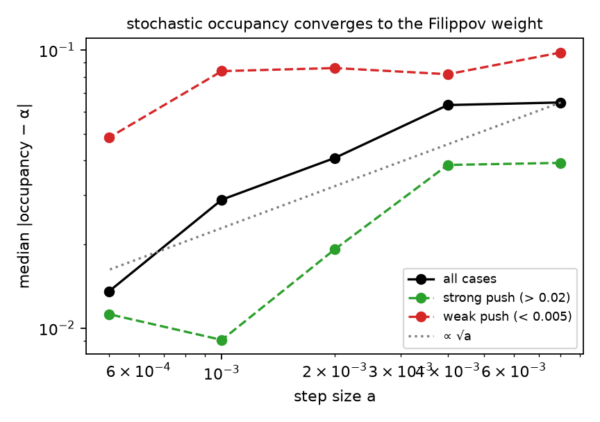
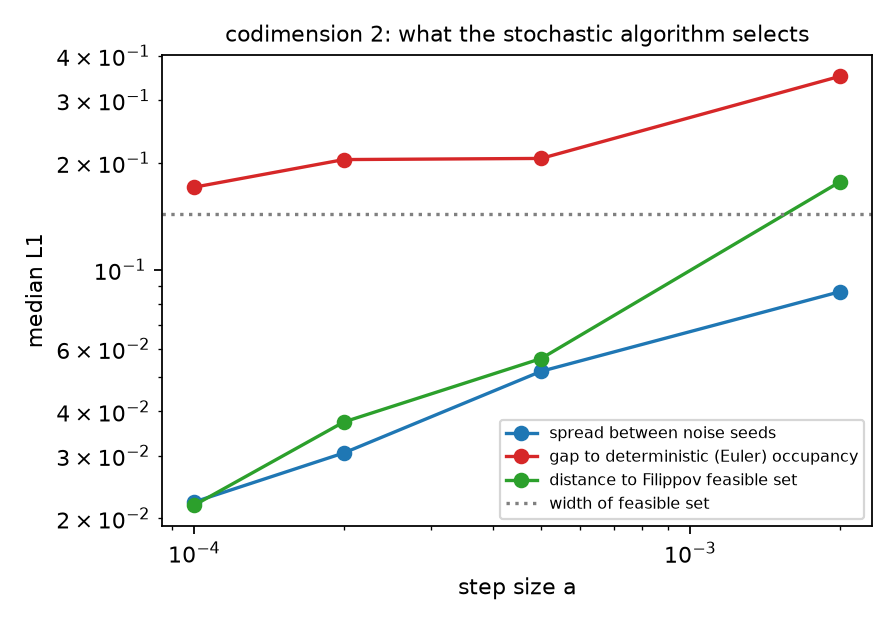

# Policy churn as Filippov sliding in Double Q-learning

Q-learning methods that select actions by argmax have update dynamics that are **discontinuous across
the boundaries between greedy regions** of parameter space. This repository studies one consequence,
policy churn (Schaul et al., 2022), as **sliding on those boundaries**, quantitatively, in Double(-SOR)
Q-learning with linear features. It asks:

1. how often the dynamics are trapped on a greedy-region boundary, where the greedy action keeps flipping;
2. whether the fraction of time each action is greedy follows the Filippov weight of the two one-sided
   drifts, including in the small-step limit;
3. whether this survives a moving target network; and
4. on intersections of two boundaries (codimension 2), where Filippov's conditions do not determine how
   time splits between regions, what the stochastic algorithm actually does: the question addressed for
   SGD by Borkar (2026).

## Background and attribution

**Prior work on these dynamics.** Gopalan & Thoppe (2025) analyse linear DQN with ε-greedy exploration,
experience replay and a target network. They partition parameter space into greedy regions on which the
expected update is linear and changes discontinuously across region boundaries, stitch the regional
dynamics into a differential inclusion by Filippov convexification, and prove that the limit points are
fixed points of projected Bellman operators that need not correspond to good policies. Their examples
include iterates that slide along a region boundary to a sliding-mode attractor, and iterates that
chatter between regions. This answers questions going back to the chattering of linear SARSA (Gordon,
1996) and the corresponding open problem in Sutton (1999). **The picture of argmax-based Q-learning as a
system with sliding modes on greedy-region boundaries is theirs**; this repository arrived at it from a
different direction (below) and adds quantitative checks rather than new theory.

**Discontinuous stochastic approximation.** Borkar (2026) studies constant-step SGD whose drift is
discontinuous across a lower-dimensional manifold M and points into M from both sides. On a
codimension-1 manifold the iterates are held near M and move under the classical Filippov combination of
the one-sided drifts h⁺ and h⁻ (Filippov, 1988),

$$
g = \frac{\lVert h^-_n\rVert\, h^+ + \lVert h^+_n\rVert\, h^-}{\lVert h^+_n\rVert + \lVert h^-_n\rVert},
\qquad
\alpha = \frac{\lVert h^-_n\rVert}{\lVert h^+_n\rVert + \lVert h^-_n\rVert},
$$

where h±ₙ are the components normal to M and α is the relative frequency of the '+' side. His new results
concern **codimension ≥ 2**, where the effective dynamics depend on an averaging measure over normal
directions that, for SGD, the small-noise limit pins down. Borkar's paper does not discuss reinforcement
learning, and his main theorems assume a gradient drift; the temporal-difference drift is not a gradient,
so here only the general sliding description is used and the codimension-2 question is examined
empirically.

## Setting

Linear action values Q_θ(s, a) = φ(s, a)ᵀθ, a fixed behaviour distribution d(s, a), a frozen target
network θ̄ (the inner loop between target synchronisations, except where stated), and the Double-SOR target

$$
y_\omega(s,a;\theta) = \omega\Bigl(r + \gamma \sum_{s'} P(s'\mid s,a)\, \bar Q\bigl(s', \arg\max_b Q_\theta(s',b)\bigr)\Bigr)
  + (1-\omega)\, \bar Q\bigl(s, \arg\max_c Q_\theta(s,c)\bigr),
$$

with ω = 1 giving Double Q-learning's target (van Hasselt et al., 2016) and ω ≠ 1 Double SOR's (Kamanchi
et al., 2020). The expected drift h(θ) = Σ d(s, a) φ(s, a) [y_ω − Q_θ(s, a)] jumps across each tie
hyperplane M_s = {Q_θ(s, 1) = Q_θ(s, 2)} because the argmax selects which target value Q̄ is used. Unlike
Gopalan & Thoppe's setting, the behaviour distribution is fixed, so the only discontinuity is in the
target.

**Instances.** Random MDPs (6 states, 2 actions, Dirichlet(0.5) transitions, normal rewards,
4-dimensional normal features, Dirichlet state–action weighting d, random θ̄ and θ₀), γ = 0.9,
ω ∈ {0.7, 1.0, 1.3, 1.6}.

**Procedure.** For each instance and ω: integrate the expected drift (Euler, step 0.01) and detect
codimension-1 sliding (in the last quarter, exactly one state's greedy action flips at least 20 times
while θ is at rest); compute α from the two one-sided drifts at θ projected onto M_s and check the
attraction condition h⁺ₙ < 0 < h⁻ₙ; run the stochastic algorithm (sampled (s, a) ~ d and s′ ~ P,
constant step size) from the same start and measure the occupancy and churn rate (greedy flips per
update) over the second half.

## Results

### Codimension-1 sliding (300 instances × 4 values of ω, step size 0.002)

| ω | instances with codimension-1 sliding | ODE occupancy − α (median abs.) | stochastic occupancy − α (median abs.) | correlation (α, stochastic occupancy) | within 0.05 | churn (flips per update, median) |
|---|---|---|---|---|---|---|
| 0.7 | 61 / 300 (20%) | 0.001 | 0.023 | 0.90 | 64% | 0.030 |
| 1.0 | 45 / 300 (15%) | 0.001 | 0.041 | 0.95 | 60% | 0.030 |
| 1.3 | 42 / 300 (14%) | 0.001 | 0.035 | 0.97 | 69% | 0.035 |
| 1.6 | 58 / 300 (19%) | 0.001 | 0.047 | 0.73 | 52% | 0.028 |
| all | 206 / 1200 (17%) | 0.001 | 0.040 | 0.88 | 61% | 0.032 |

| weaker normal push min(‖h⁺ₙ‖, ‖h⁻ₙ‖) | cases | median abs. error (stochastic) |
|---|---|---|
| [0, 0.005) | 48 | 0.103 |
| [0.005, 0.02) | 57 | 0.043 |
| [0.02, inf) | 101 | 0.019 |

Detected chattering cases failing the Filippov attraction condition: 0.







### Step-size limit (codimension 1)

60 sliding cases re-run with the ODE time horizon fixed (600 time units).

| step size | median \|occupancy − α\| | mean | correlation with α | churn (flips per update, median) |
|---|---|---|---|---|
| 0.008 | 0.065 | 0.113 | 0.83 | 0.0343 |
| 0.004 | 0.063 | 0.088 | 0.91 | 0.0275 |
| 0.002 | 0.041 | 0.071 | 0.93 | 0.0241 |
| 0.001 | 0.029 | 0.057 | 0.95 | 0.0234 |
| 0.0005 | 0.014 | 0.040 | 0.97 | 0.0232 |

### Moving target (Polyak averaging at rate β, step size 0.002)

| β | cases | still churning (> 0.005 flips per update) | churn (median) | late windows with mixed greedy action (median) |
|---|---|---|---|---|
| 0 | 30 | 100% | 0.0357 | 1.00 |
| 1e-05 | 30 | 13% | 0.0000 | 0.00 |
| 0.0001 | 30 | 7% | 0.0000 | 0.00 |

### Codimension 2

45 instances with two states chattering at once and a non-empty Filippov feasible set (scan of 1,500 instances at each of ω = 1.0 and 1.3). Occupancies are over the four sign patterns; distances are L1.

| quantity | median |
|---|---|
| width of the feasible set (largest range of any pattern's weight) | 0.144 |
| distance of the Euler occupancy to the feasible set, dt = 0.01 | 0.0054 |
| same, dt = 0.0025 | 0.0023 |
| change in Euler occupancy between dt = 0.01 and 0.0025 | 0.0076 |
| distance of the stochastic occupancy to the feasible set, a = 0.002 | 0.146 |
| same, a = 0.0005 | 0.083 |
| stochastic (a = 0.002) vs Euler (dt = 0.0025) occupancy | 0.344 |
| stochastic (a = 0.0005) vs Euler (dt = 0.0025) occupancy | 0.230 |
| product of codimension-1 weights vs Euler occupancy (12 cases with both weights defined) | 0.510 |



### Codimension 2 at small step sizes: what selects the split

The 45 codimension-2 cases above, re-run with four independent noise seeds at each of four step sizes
(`run_codim2_small.py`). Criteria, fixed before the run: the split is **definite** if the spread between
seeds (mean pairwise L1 between their occupancy vectors) shrinks with the step; it is **on the Filippov
set** if the distance of the seed-averaged occupancy to the feasible set goes to 0; it **differs from
the deterministic selection** if its L1 gap to the Euler occupancy stays clearly above the seed spread and
does not trend to 0.

| step size | seed spread (median L1) | distance to Filippov set (median) | gap to deterministic occupancy (median L1) | cases where gap > 2 × spread |
|---|---|---|---|---|
| 0.002 | 0.087 | 0.177 | 0.350 | 80% |
| 0.0005 | 0.052 | 0.056 | 0.206 | 76% |
| 0.0002 | 0.031 | 0.037 | 0.204 | 84% |
| 0.0001 | 0.022 | 0.022 | 0.171 | 91% |

45 cases; median width of the Filippov feasible set 0.144.



Between the two smallest step sizes the per-case gap to the Euler occupancy changed by a median factor of
0.93: it was flat (within 5%) in about half of the cases and still fell by more than 20% in about a
quarter. At a = 10⁻⁴ the median gap is 10.4 times the seed spread.

## Observations

1. **Sliding on greedy-region boundaries is common with a frozen target.** About one instance in six
   (14–20% depending on ω) is trapped on a tie hyperplane, and every detected case satisfies the
   Filippov attraction condition.
2. **The churn there follows the Filippov occupancy, and converges to it in the small-step limit.** The
   median error falls from 0.065 to 0.014 and the correlation rises from 0.83 to 0.97 as the step size
   falls from 0.008 to 0.0005, roughly like √a. Cases with a weak normal drift converge more slowly.
3. **Sliding churn is a property of the dynamics, not of the learning rate.** Flips per update level off
   at about 2.3% as the step shrinks: a smaller step tightens the oscillation around the boundary but
   does not stop the greedy action from switching.
4. **Over-relaxation does not remove it.** Sliding frequency is non-monotone in ω and churn stays near 3%.
5. **With a moving target, sliding largely disappears** (100% → 13% → 7% of cases still churning at
   β = 0, 10⁻⁵, 10⁻⁴). In this setting the discontinuity comes from the mismatch between the online and
   target networks: when θ̄ = θ, the Double target reduces to the plain max, which is continuous. With
   periodic hard synchronisation, as in standard DQN, the mismatch reappears after every sync, so sliding
   can recur within each inner loop. In Gopalan & Thoppe's setting, ε-greedy sampling adds a discontinuity
   that does not vanish this way.
6. **In codimension 2, noise selects a definite split, different from the deterministic one.** The
   Filippov conditions leave a family of admissible splits between the four sign patterns (median width
   0.14). As the step size falls from 0.002 to 10⁻⁴, independent noise seeds converge to the same split
   (spread 0.087 → 0.022), which lies in the Filippov feasible set (distance → 0.022), while its gap to the
   split selected by the Euler-discretised expected dynamics stays near 0.17–0.20, about ten times the seed
   spread. This is consistent with Borkar's (2026) view that noise determines the averaging measure in
   codimension ≥ 2, here for a non-gradient drift that his theorem does not cover. His theorem's specific
   prediction (weights from a large-deviations potential) was not computed. The gap was still drifting
   down slowly in some cases, so convergence to the Euler point at much smaller steps is not excluded,
   and "deterministic" refers to one scheme, fixed-step Euler; another discretisation may select
   differently. A product of codimension-1 weights is a poor description (L1 0.51).

## Policy churn through this lens

- **Churn can be structural.** On an attracting boundary, neither greedy action can persist: each one
  selects a target that moves the values toward the other. The greedy action then flips at a steady rate
  that removing noise does not eliminate.
- **Sliding makes a greedy learner act like a stochastic one.** On the boundary the agent plays one
  action a fraction α of the time and the other otherwise, a mixed policy whose probabilities are set by
  the geometry of the update. This gives a quantitative form to the view of churn as implicit exploration
  (Schaul et al., 2022) for the churn that sliding produces.
- **Sliding is one source of churn, not all of it.** Churn also arises from noise near small action
  gaps, from generalisation across states, from target synchronisation and from shifting data. How much
  of the churn of a deep RL agent comes from sliding has not been measured.

## What is and is not new here

- **Not new:** greedy-region boundaries as discontinuities of the Q-learning drift; sliding and chattering
  on them; their analysis by differential inclusions (Gopalan & Thoppe, 2025; earlier chattering results:
  Gordon, 1996). Codimension-1 Filippov sliding itself is classical (Filippov, 1988).
- **Added here:** quantitative evidence that churn on attracting boundaries follows the Filippov
  occupancy and converges to it as the step shrinks; that sliding churn per update does not vanish with
  the step size; prevalence across random instances; the dependence on online–target mismatch; the
  Double-SOR variant; and evidence that in codimension 2 the noisy algorithm selects a definite
  Filippov-admissible split that differs from the deterministic (Euler) one, for a non-gradient Q-learning
  drift.

## Limitations

- Linear features and small random MDPs; a fixed behaviour distribution (no ε-greedy discontinuity).
- Sliding was detected only when the iterate comes to rest on the boundary (sliding-mode equilibria); the
  velocity along the boundary during sliding was not compared with g.
- Codimension 2: 45 cases, step sizes down to 10⁻⁴, four noise seeds; the deterministic reference is
  fixed-step Euler only; Borkar's predicted measure was not computed.
- The detection thresholds (20 flips, θ at rest) affect the counts but not the occupancy comparisons.

## Usage

```bash
pip install -r requirements.txt
python -m pytest                               # three checks, about two seconds
python run.py && python analyze.py             # codimension-1 experiment, ~15 min on 3 cores
python run_extensions.py stepsize moving codim2 --workers 3 && python analyze_extensions.py   # ~1-2 h
python run_codim2_small.py --workers 3 && python analyze_codim2_small.py          # ~2-3 h
```

## Layout

```
filippov/dynamics.py     instances, expected drift, Euler and stochastic dynamics, codimension-1 detection, α
filippov/extensions.py   step-size runs, moving target, codimension-2 detection and the Filippov feasible set
run.py, analyze.py                       codimension-1 experiment, tables and figures
run_extensions.py, analyze_extensions.py extension experiments, tables and figure
run_codim2_small.py, analyze_codim2_small.py  codimension-2 selection at small step sizes
tests/                   a one-dimensional Filippov check and consistency checks
results/, figures/       outputs
```

## References

- Borkar, V. S. (2026). Stochastic gradient descent with discontinuity across a manifold.
  *arXiv:2608.07618*.
- Borkar, V. S. (2022). *Stochastic Approximation: A Dynamical Systems Viewpoint* (2nd ed.). Springer.
- Filippov, A. F. (1988). *Differential Equations with Discontinuous Righthand Sides*. Kluwer Academic.
- Gopalan, A., & Thoppe, G. (2025). Does DQN learn? *IEEE Transactions on Automatic Control*;
  *arXiv:2205.13617*.
- Gordon, G. J. (1996). Chattering in SARSA(λ). CMU Learning Lab internal report.
- Kamanchi, C., Diddigi, R. B., & Bhatnagar, S. (2020). Successive over-relaxation Q-learning. *IEEE
  Control Systems Letters*, 4(1).
- Schaul, T., Barreto, A., Quan, J., & Ostrovski, G. (2022). The phenomenon of policy churn. *Advances in
  Neural Information Processing Systems (NeurIPS)*.
- Sutton, R. S. (1999). Open theoretical questions in reinforcement learning. *European Conference on
  Computational Learning Theory (EuroCOLT)*.
- van Hasselt, H., Guez, A., & Silver, D. (2016). Deep reinforcement learning with double Q-learning.
  *AAAI Conference on Artificial Intelligence*.
